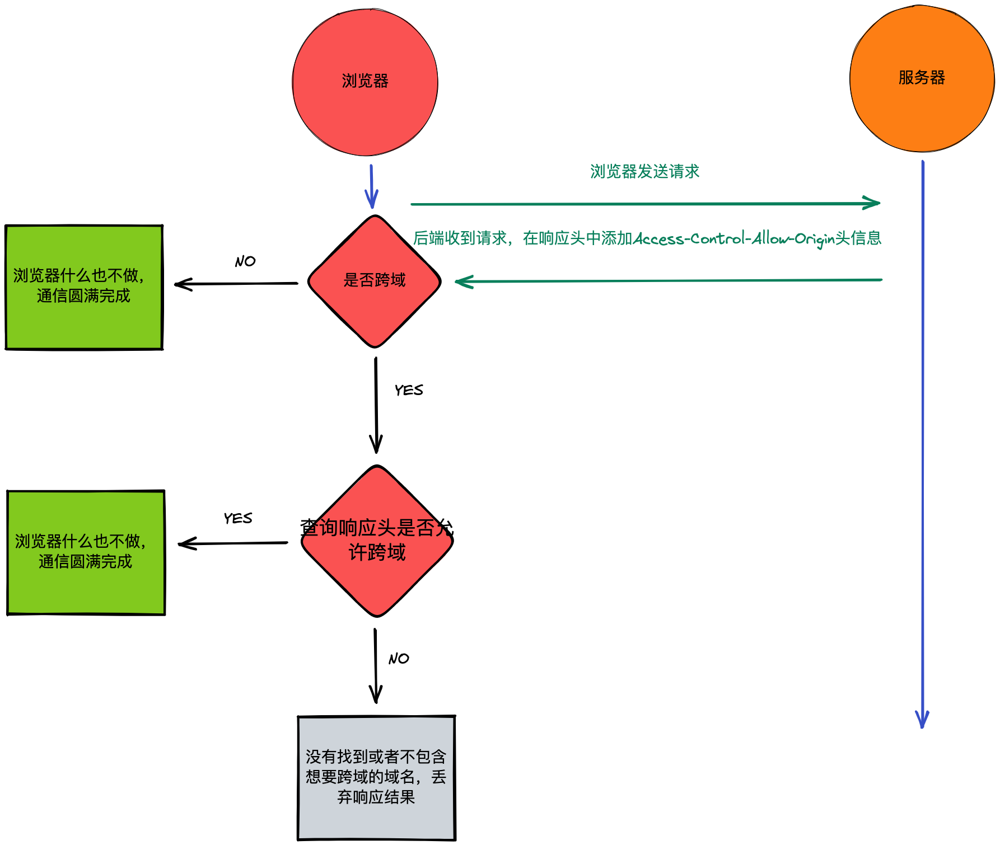
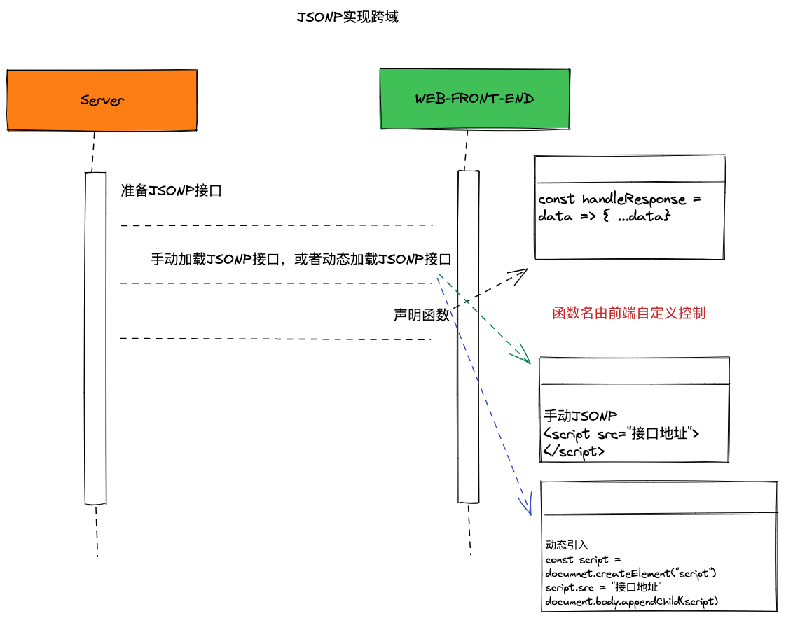

# Ajax&Fetch 与跨域请求

## Ajax

- Asynchronous JavaScript and XML 异步 JS 和 XML 的简写

- 可以异步的向服务器发送请求，在等待的过程中，不会阻塞当前页面，浏览器可以做自己的事情，直到成功获取响应后，浏览器才开始处理响应数据

- XML 可扩展标记语言，前后端数据通信时传输的一种格式

- XML 现在不怎么用了，比较常用的是 JSON

- 通过 AJAX 可以在不重新加载整个页面的情况下，对页面的某个部分进行更新

### Ajax 的基本用法

1. XMLHttpRequest

   - Ajax 想要实现浏览器与服务器之间的异步通信，需要依靠 XMLHttpRequest，它是一个构造函数
   - 不论是 XMLHttpRequest，还是 Ajax，都没有和具体的某种数据格式绑定

2. Ajax 的使用步骤

   ```js
   //1 创建xhr对象
   const xhr = new XMLHttpRequest();
   //4 监听事件，处理响应
   //当获取到响应后，会触发xhr对象的readystatechange事件，可以在该事件中对响应进行处理
   xhr.onreadystatechange = () => {
     //只有状态为4才会执行之后的操作
     if (xhr.readyState !== 4) return;
     //接下来判断响应的HTTP CODE
     //获取响应之后，响应的内容会自动填充xhr对象的属性
     //304 使用缓存
     //xhr.status http code 200 404 301 304 500 ...
     //xhr.statusText http状态说明 ok Not Found ...
     if ((xhr.status >= 200) & (xhr.status < 300) || xhr.status === 304) {
       console.log("正常使用响应数据");
       console.log(xhr.responseText);
     } else {
       //处理错误
     }
   };
   // readystatechange 使用addEventListener,IE6~IE8不兼容
   // 为了兼容性，不要在readystatechange事件中使用this，而是要使用xhr
   // 还是兼容性问题，将readystatechange事件放在open之前最好
   // readystatechange 事件监听readyState这个状态的变化
   // 它的值从0～4，一共5个状态
   //0 未初始化。尚未调用open()
   //1 启动。已经调用open()，但尚未调用send()
   //2 发送。已经调用send()，但尚未接收到响应
   //3 接收。已经接收到部分响应数据
   //4 完成。已经接收到全部响应数据，而且已经可以在浏览器中使用了
   //2 准备发送请求
   xhr.open("http方法 GET、POST、PUT、DELETE", "URL", true);
   //3 发送请求
   //send() 的参数是通过 请求体 携带的数据
   // http方法是GET时，send不能传数据，因为GET没有请求体，可以在send里面写null传过去
   xhr.send();
   ```

3. 使用 Ajax 完成前后端通信

   ```js
   const url = "https://www.imooc.com/api/http/search/suggest?words=js";
   ```

### GET 请求

1. 携带数据

- 通过 URL 传递

2. 数据的编码

- 如果携带的数据是非英文字母的话，比如说汉字，就需要编码之后在送给后端，不然会造成乱码问题
- 可以使用 encodeURIComponent()编码

### POST 请求

1. 携带数据

   - 主要通过请求体携带数据，同时也可以通过请求头携带
   - 如果想发送数据，直接写在 send() 的参数位置，一般是字符串

2. 数据编码
   `encodeURIComponent(str)`

## JSON

- JavaScript Object Notation

### JSON 的三种形式

1. 简单值形式

   - 没有 undefined
   - 必须使用双引号
   - 不能注释

2. 对象形式

   - 对应 js 中的对象

3. 数组形式

   - 对应 js 中的数组

### JSON 的常用方法

1. JSON.parse()

   - JSON -> Object

2. JSON.stringify()

   - 基本数据类型 / Object / Array -> JSON

- 使用上面的两个方法封装 localStorage

  - [方法](./storage.js)

## 跨域请求

- 向一个域发送请求，如果要请求的域和当前域是不同域，就叫做跨域。不同域之间的请求，就是跨域请求

- 什么是不同域，什么是同域

  - http(协议)://baidu.com(域名):441(端口号)/info/list(路径)
  - 协议、域名、端口号，任何一个不一样，就是不同域
  - 与路径无关，路径不一样无所谓

- 跨域请求为什么会被阻止

  - 阻止跨域请求，其实是浏览器本身的一种安全策略 - 同源策略
  - 其他客户端、服务器都不存在跨域被阻止的问题

- 解决方案

  - CORS 跨域资源共享
  - JSONP

### CORS 跨域资源共享

- 主要是通过后端解决

- 服务器返回的响应头中，`Access-Control-Allow-Origin: *` 字段，可以允许让浏览器允许不同域的请求，\*是通配符，表示没有任何限制

- 也可以设置为指定域名的跨域请求

- 流程
  

- CORS 的兼容性：IE10 及以上版本的浏览器可以正常使用

### JSONP

- 实现原理

  - 通过 script 标签，可以加载到任何跨域文件，不会被浏览器阻止

- 使用 JSONP 实现跨域
- 流程
  

### XHR 的属性

1. responseType 和 response

   - 当 responseType 没有设置的时候，responseType 默认为“”或者“text”，此时 response 和 responseText 一样
   - 在 open()和 send()之间设置 responseType，当 responseType = "json"的时候，返回 responseText 就会报错，此时只能用 response
   - 当确定后端返回的是 json 数据时，可以使用 responseType = "json"，省略 JSON.parse 的解析这一步骤
   - 这两个属性只能在 IE10 及以上版本可以用，以下版本的浏览器会有兼容性问题

2. timeout 属性

   - 设置请求的超时时间，单位是 ms
   - 在 open send 之间设置
   - `xhr.timeout = 1000`
   - 超时的时候会触发 timeout 事件，`xhr.ontimeout`
   - IE6、IE7 不支持，从 IE8 开始

3. withCredentials 属性

   - 指定使用 Ajax 发送请求时是否携带上 Cookie
   - 使用 Ajax 发送请求时，默认情况下，同域时，会携带 Cookie，跨域时，不会
   - `xhr.withCredentials = true`
   - 最终能否成功携带跨域 Cookie，还要看服务器同不同意
   - 从 IE10 开始

### XHR 的方法

1. abort()

   - 终止当前请求
   - 一般配合 abort 事件一起使用，在 send()之后调用

2. setRequestHeader()

   - 设置请求头信息
   - `xhr.setRequestHeader(头部字段的名称,头部字段的值)`
   - open 和 send 之间设置
   - 唯一需要关注的可以设置的属性：`Content-Type, application/x-www-form-urlencoded`
   - 设置这个属性的前提
     1. 是 POST 请求
     2. send 中发送了数据
   - 请求头中的 Content-Type 字段，是用来告诉服务器，浏览器发送的数据是什么格式的
     - application/x-www-form-urlencoded："username=tom&age=18..."
     - application/json: 传输 JSON 格式的数据
   - form 表单的 enctype 的默认值就是 application/x-www-form-urlencoded

### XHR 的事件

1. load

   - 代替 readystatechange 事件，需要对反应的 code 做判断
   - 兼容性，IE9 开始，因为 addEventListener 也是
   - 所以 load 搭配 addEventListener 一起使用

2. error

   - 请求发生错误时触发
   - IE10 开始

3. abort

   - 调用 abort 方法时
   - 从 IE10 开始

4. timeout

   - 请求超时时触发

## 封装 Ajax

### Form Data

1. 使用 Ajax 提交表单

2. FormData 的基本用法
   - 通过 form 表单元素创建 FormData `const data = new FormData(表单元素);`
   - 不通过表单元素创建时， 可以通过实例的 append(key,value)添加数据 `data.append("age", 18)`

### 封装 Ajax

- [封装文件](./ajax/)

### 使用 Promise 改造封装好的 Ajax

- [封装文件](./ajax/index.js)

## Ajax 搜索提示

- 注意点：设置 setTimeout 为什么要先判断 timer 是否为空，不为空时为何要清除

- [搜索](./search.html)

### Ajax 二级菜单

- [二级菜单](./menu.html)

### 多个 Ajax 请求的并发执行

- 判断多个个并发是否都执行完了，使用`Promise.all([p1,p2,p3...])`

- [多个 Ajax 请求的并发执行](./ajax7-4.html)

## Axios 与 Fetch

### Axios

- [第三方 Ajax 库](http://axios-js.com/zh-cn/docs/)

- 一个基于 Promise 的 HTTP 库，可以用于浏览器和 node.js 中

- 基本用法
  - [文件](./axios.html)
  1.  引入 axios

### Fetch

- Fetch 用来替代 Ajax，在未来
- Ajax 是一门成熟的技术，兼容性更好
- Fetch 没有 abort timeout

- Fetch 的基本用法

  - fetch 是一个浏览器原生 API，可以直接调用
  - fetch 返回一个 Promise 实例

  ```js
  //body/bodyUsed: 只能读一次，读过之后就不让再读了
  //ok: 如果为true，表示可以读数据，不用再去判断HTTP状态码
  ```
