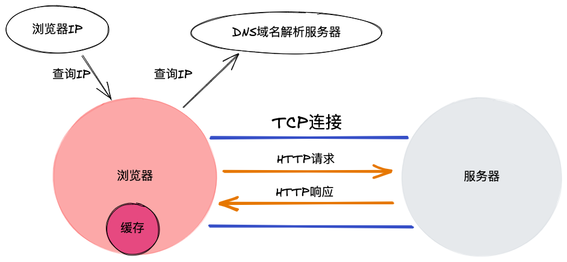

# 前后端的通信

## 通信方式

- chrome 浏览器，一次可以向同一域名发送 6 个并发请求

- 将资源分散给不同域名，可以最大化利用并发数

- 将小图片合并为一张雪碧图，就是为了减少请求数

### 浏览器何时向服务器发送请求

1. 会向服务器发送请求的标签

   - html
   - link / img / script / iframe

2. 不会向浏览器发送请求，但用户可以使用它们向浏览器发送请求

   - a / form

3. Ajax 和 Fetch

## HTTP 协议

### 超文本

- 由原先一个个单一文本，通过超链接将其联系起来，变成可无限延伸、扩展的超级文本、立体文本

### 超文本传输协议

- 规定：每一次前后端通信，前端需要主动向后端请求，后端接收到前端的请求后，可以给出响应

- http 是一个请求响应协议



## HTTP 报文

- 浏览器向服务器发送请求时，请求本身就是信息，叫做请求报文

- 服务器向浏览器发送响应是传输的信息，叫做响应报文

### HTTP 报文格式

```
请求报文：
请求头： 起始行 + 首部
请求体
GET请求没有请求体，数据通过请求头携带
POST请求有请求体，数据在请求体中携带

···························
响应报文：
响应头： 起始行 + 首部
响应体
```

## HTTP 方法

### 常用的 HTTP 方法

- GET POST PUT DELETE

### HTTP 方法的语义

- GET 获取数据、获取资源

- POST 创建数据

- PUT 更新数据

- DELETE 删除数据

### RESTful 接口设计

- 对同一个对象，使用 http 语义进行区分

### GET POST 方法对比

- 语义

- 缓存

  - GET 可以被缓存
  - POST 不会被缓存

- 发送数据

  - GET，通过地址在请求头中携带数据，能携带的数据量和地址的长度有关系，一般最多几 k
  - POST，既可以通过地址在请求头中携带数据，也可以通过请求体携带数据，理论上可携带的数据是无限的，实际情况根据具体浏览器而定

- 安全性
  - 都不安全

### HTTP 状态码

- 定义服务器对请求的处理结果，从服务器返回

- 常见状态码的语义

  1. 100 ～ 199 消息：代表请求已被接受，需要继续处理，主要用于 websocket
  2. 200 ～ 299 成功，200 ok
  3. 300 ～ 399 重定向
     - 301 Moved Permanently，永久性跳转，会被用户缓存，谨慎使用
     - 302 Move Temporarily，临时性跳转
     - 304 Not Modified，没有修改
  4. 400 ～ 499，请求错误
     - 404 Not Found
  5. 500 ～ 599
     - 500 Internal Server Error
