# 移动 Web 开发

- 重点
  1.  布局
  2.  移动端事件
  3.  性能优化

## 移动端概念

1. 分辨率

2. 物理像素

   - 设备本身具有的像素，实际的物理点
   - physical pixel / dp: device pixel

3. CSS 像素

   - 逻辑像素 / 设备独立像素
   - logical pixel / dip: device independent pixel

4. 设备像素比（dpr）

   - dpr: device pixel ratio
   - dpr = (在一个方向上) 设备像素 / CSS 像素(没有缩放时)

5. 标清屏和高清屏

   - dpr = 1 标清屏
   - dpr > 1 高清屏

6. 缩放

   - 用户通过手指，缩放改变 CSS 像素的大小
   - 分为放大和缩小

7. PPI/DPI

   - 每英寸的物理像素点
   - PPI : pixels per inch
   - DPI : dots per inch
     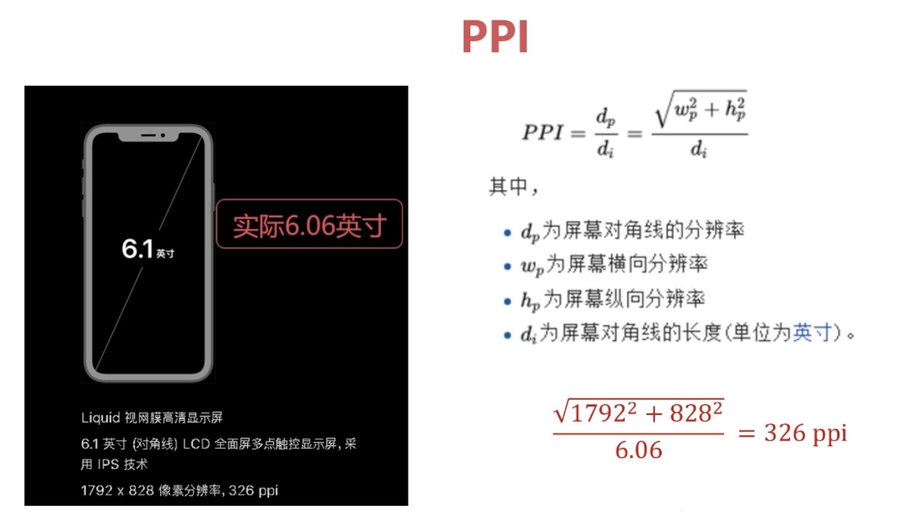

## 视口 viewport

- 布局视口

- 视觉视口

- 理想视口： 布局视口 = 视觉视口

### 设置视口

- `<meta name="viewport" content="width=device-width">`
- 大抵等价写法
- `<meta name="viewport" content="initial-scale=1">`
- 各自会有各自的兼容性问题，所以每次都一起写上
- `<meta name="viewport" content="width=device-width,initial-scale=1">`

- initial-scale 的值，表示的是 设备像素缩放比 = 手机逻辑像素/CSS 逻辑像素，所以比值小，css 逻辑像素高

- 禁止放大
- `<meta name="viewport" content="user-scalable=no">`
- `<meta name="viewport" content="initial-scale=1,maximum-scale=1,minimum-scale=1">`

### 获取视口宽度

- 布局视口
  - `document.documentElement.clientWidth`
  - `document.documentElement.getBoundingClientRect().width`

## 常用单位

- px 绝对单位， 设定固定宽高，也可用于设置字体

- % 可以用来布局，相对单位，设置宽度，流体布局中使用

- em

  - 相对单位，设置字体大小时， 1em = 父元素字体大小
  - 设置其他，比如宽高时，1em = 自身字体的大小
  - 一般用来控制首行缩进，不用来布局
  - `font-size:12px; text-indent: 2em;`
  - 缩进两个字符

- rem (root element => html ) 可以用来的布局

  - 相对于 html 跟元素的字体大小， 1rem = 跟元素的字体大小

- vw/vh/vmax/vmin

  - vmax：当前 vw 和 vh 中较大的一个值
  - vmin：当前 vw 和 vh 中较小的一个值

## 流体布局

- 百分比布局

## Flex

- Flex 布局

  - 弹性盒子
  - `display: flex || display: inline-flex`

- Flex 容器 flex container

  - 采用 flex 布局的元素，就是 flex 容器

- Flex 项目 flex item

  - flex 容器的所有子元素自动成为容器成员，称为 flex 项目

- 主轴 · 交叉轴

  - 默认情况下，水平方向的是主轴，垂直于主轴方向的是交叉轴
    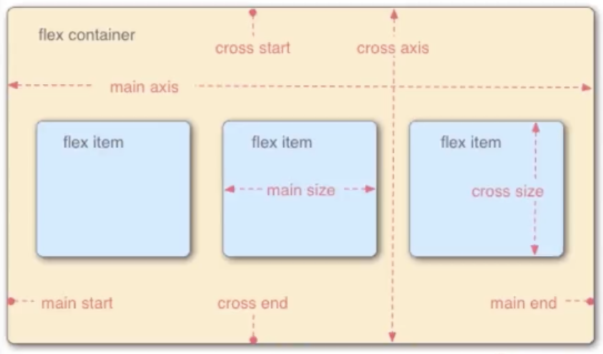
  - flex 默认沿主轴起始排列

### flex 容器属性

1. flex-direction

   - row | row-reverse | column | column-reverse

2. flex-wrap

   - nowrap | wrap | wrap-reverse

3. flex-flow

   - flex-direction and flex-wrap 的简写形式

4. justify-content

   - flex-start | flex-end | center | space-between | space-around

5. align-items

   - stretch | flex-start | flex-end | center | baseline
   - 如果 flex 项目未设置交叉轴方向的大小或者 auto，将占满整个容器交叉轴方向的大小
     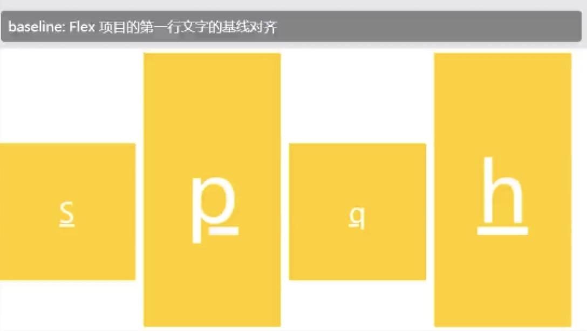

6. align-content

   - 定义了存在多根主轴线时，flex 项目在交叉轴上如何对齐，如果项目只有一根主轴线，该属性不起作用
   - stretch | flex-start | flex-end | center | space-between | space-around

### flex item 项目上的属性

1. order

   - 定义了 flex 项目的排列顺序
   - 数值越小，排列越靠前，默认为 0

2. flex-grow

   - 定义了 flex 项目在主轴方向上的放大比例，默认为 0，即如果存在剩余空间，该项目也不放大
     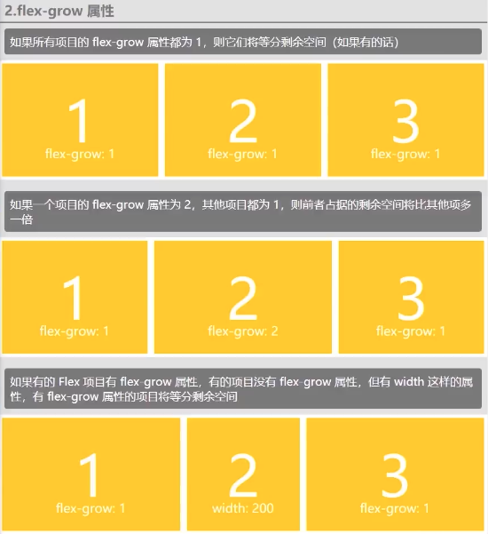

3. flex-shrink

   - 定义了 flex 项目在主轴方向上的缩小比例，默认为 1，即如果空间不足，该项目将缩小
     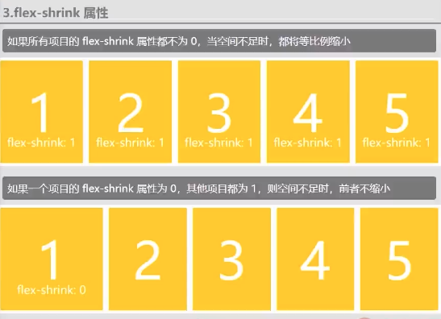

4. flex-basis

   - 定义了在分配多余空间之前，flex 项目占据的主轴大小(main size)
   - 浏览器根据这个属性，计算主轴是否有多余空间
   - 默认值为 auto，即项目的本来大小

5. flex

   - flex-grow, flex-shrink, flex-basis 的简写，默认值为 0 1 auto
   - 快捷值， auto(1 1 auto) / none(0 0 auto)

6. align-self

   - stretch | flex-start | flex-end | center | baseline
     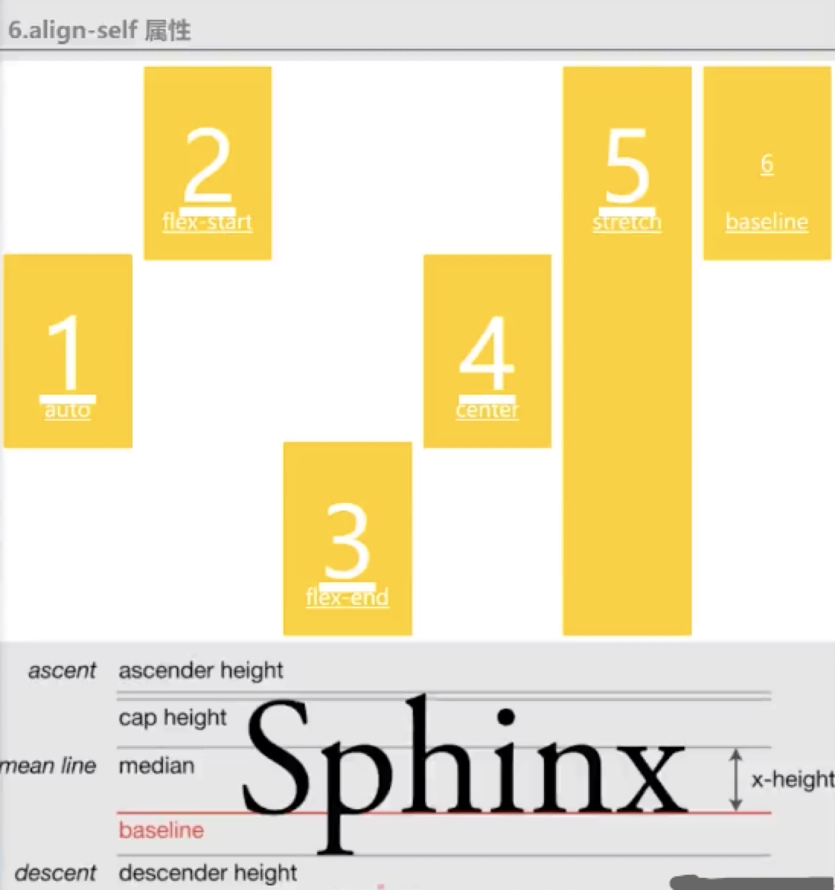

## rem vw 布局

- 实现等比例缩放的效果

### rem 布局方案

1. 原理

   - 确定设计稿的宽高比：750px / 96px
   - 1rem = html 的 font-size，例如：html-font-size = 10px， 此时的 1rem = 10px
   - 当屏幕变化的时候修改 html 的字体大小
   - viewWidth / 设计稿初始宽度(750px) = 当前 html 字体大小 / 初始 html 字体大小(10px)
   - 当前 html 字体大小 = (viewWidth \* 初始 html 字体大小) / 750px
   - 通过 js 计算出视口大小，改变 html 字体大小，从而影响布局

2. 实现

   - 安装 px2rem 插件

3. 扩展 flexible

   - [flexible](https://github.com/amfe/lib-flexible)
   - 了解即可
   - 解决 1px 边框问题

### vw+rem 布局方案

1. 原理

   - 100vw / 750px = ?vw / 10px
   - ?vw = 100vw / 75px

2. 实现

   -

   ```css
   html {
     font-size: 1.33333vw;
   }
   ```

3. 可以在不改变 rem 的情况下，取消 js 的代码，实现和 rem 布局一样的效果

### vw 布局方案

1. 原理

   - 计算出测量值对应的 vw 单位的值
   - `测量 px / 750px = ?vw / 100vw`
   - `?vw = 测量 px * 100vw / 750px`
   - 使用插件 px2vw

2. 方案选择

   - 优先使用 vw 布局方案，如果条件不允许，再选择 rem 方案

## 响应式布局

- 对不同尺寸的屏幕做出响应(媒体查询)，并进行相应的布局

### 媒体查询

1. 语法

   - `@media screen and (min-width:){}`

2. 媒体类型

   - all 所有设备，默认值
   - screen 屏幕设备
   - print 打印设备
   - speech 屏幕阅读器，一般供残障人士使用

3. 媒体查询的逻辑

   - 与(and)，或(,) 非(not)

4. 媒体特性

   - `width / max-width / min-width`
   - `-webkit-device-pixel-ratio / -webkit-max-device-pixel-ratio / -webkit-min-device-pixel-ratio`
   - `orientation:landscape/portrait`

- tips

  - 获取设备的 dpr：`window.devicePixelRatio`

### 断点和书写位置

- bootstrap 的断点

```
xs:<576px      超小屏
sm:576~768px   小屏
md:768~992px   中屏
lg:992~1200px  大屏
xl:>=1200px    超大屏
```

- 书写位置

  1.  样式表中或者单独的 css 文件中

### 媒体查询策略

1. PC first

   - 从大到小写

   ```css
   .col {
      width:16.666667%;
   }
   @media (max-width: 1200px) {
     .col {
     }
   }
   @media (max-width: 992px) {
     .col {
     }
   }
   ...
   ```

2. mobile first 移动端优先 (推荐)

   - 从小到大写

   ```css
   .col {
      width:100%;
   }
   @media (min-width: 576px) {
     .col {
      width:50%;
     }
   }
   @media (min-width: 768px) {
     .col {
     }
   }
   ...
   ```

## Grid 布局

- 网格布局

### Grid 基本

1. grid container / grid item

   - display: grid | inline-grid

   - 子元素就是 item

2. 行列和单元格

   - 容器中的水平区域称为行 row 垂直区域称为列 column
   - 行和列的交叉区域称为单元格
     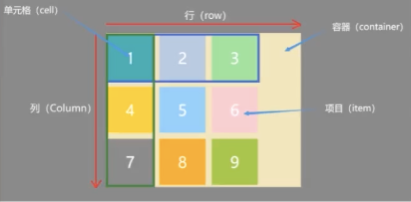

3. 网格线

   - 划分出网格的线，称为网格线 grid line
   - 水平网格线划出行，垂直网格线划分出列
     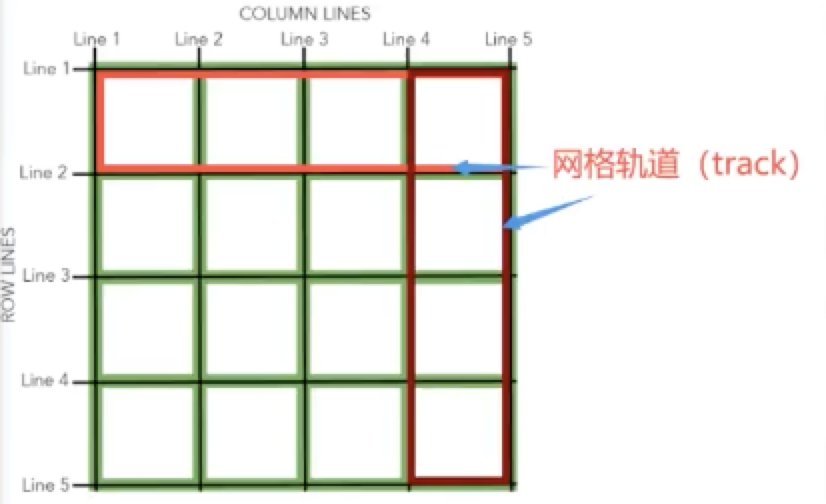

4. 其他

   - 行间距、列间距 gap
   - 区域 area
   - 内容 content
   - 网格轨道 track
     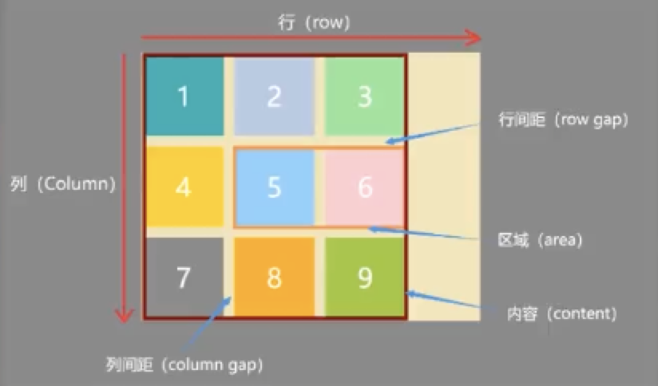

### Grid 容器的属性

1. display

2. grid-template-rows / grid-template-columns
   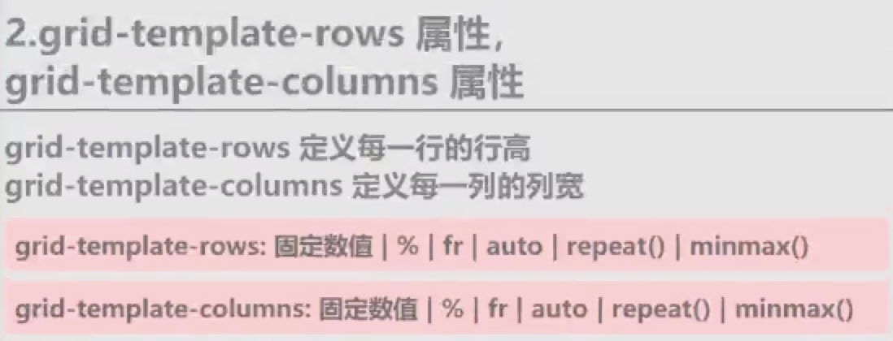

3. grid-auto-flow

4. grid-auto-rows / grid-auto-columns

5. row-gap / column-gap / gap

6. grid-template-areas

7. align-items / justify-items / place-items

8. align-content / justify-content / place-content

9. grid-template / grid

### Grid item 的属性

1. `grid-column-start / grid-column-end / grid-row-start / grid-row-end`

2. `grid-column / grid-row`

3. `grid-area`

4. `align-self / justify-self / place-self`

## 移动端事件

### touch 事件

- `touchstart / touchmove / touchend / touchcancel`

- touch 事件在 PC 端不回触发，鼠标事件在 PC 端和移动端都会触发

- 即使触摸点移出目标元素，touchmove 事件依然会持续触发，mousemove 事件不回再触发

- touch 事件的特征检测， 判断浏览器支不支持 touch 事件

  - `ontouchstart in window` ? true
    / false

### touch 事件的 event 对象

1. event 对象的常用属性

   - e.type
   - e.target
   - e.touches 所有的触摸点
   - e.targetTouches 目标元素上的所有触摸点
   - e.changedTouches 出发事件的元素上发生改变的触摸点

2. 触摸点的常用属性

   - `const touch = e.changedTouches[0]`
   - `touch.identifier` 触摸点 id，唯一标识，一般用于多指
   - `touch.target` 目标元素
   - `touch.screenX / touch.screenY` 相对屏幕的坐标，不常用
   - `touch.clientX / touch.clientY` 可视区域上的坐标
   - `touch.pageX / touch.pageY` 包含滚动条偏移的坐标
   - ``
   - ``

3. 阻止浏览器的默认行为

   - 阻止 scrolling，pinch/zoom，鼠标事件的默认行为
   - `e.preventDefault()` 全部默认行为都阻止
   - `touch-action`css 属性，告诉浏览器哪些触摸操作让浏览器处理，阻止其他触摸操作的默认行为

   ```css
   /* 默认auto 处理所有触摸操作
   *  none    不处理触摸相关操作，鼠标不受影响
   *  pan-x/pan-y 水平/垂直滚动操作  
   *  manipulation 只允许进行滚动和持续缩放操作，不允许双击缩放
   *
   *
   */
   touch-action: auto;
   ```

### 单指拖拽

- [drop-touch.html](./drop-touch.html)

## Pointer 事件

- Pointer 事件的类型

  ```
  pointerover
  pointerenter
  pointerout
  pointerleave
  pointerdown
  pointermove
  pointerup
  pointercancel
  ```

- 注意事项

  1.  Pointer 事件直接继承了鼠标事件，在其基础上有添加了其他的一些内容，处理 Pointer 事件和处理鼠标事件几乎一致
  2.  Pointer 事件在 PC 端和移动端都会触发
  3.  触摸点移出目标元素，touchmove 事件依然会持续触发，pointer 和 mousemove 事件不会再触发

- Pointer 事件的特征检测

  - `if('onpointer' in window)`

### Pointer 事件的 event 对象

- 常用属性

  ```js
  e.pointerId;
  e.type; // pointer本身的事件
  e.pointerType; // 判断此时pointer是mouse事件还是touch事件
  e.target;
  e.screenX || e.screenY;
  e.clientX || e.clientY;
  e.pageX || e.pageY;
  ```

- 阻止浏览器的默认行为

  - `e.preventDefault()` 阻止的是 PC 端的默认行为(不能阻止 scrolling, pinch / zoom, 鼠标事件等默认行为)，可以阻止图片拖动的默认行为
  - 可以在 touch 事件处理函数中，使用 e.preventDefault()阻止移动端的默认行为
  - 使用`touch-action` 设置触摸操作时浏览器的默认行为

### 单指拖拽

- [drop-pointer.html](./drop-pointer.html)

- 坑，留意上面代码的写法，对比与 touch 时的不同：

  1.  drop-touch 时的默认事件阻止
  2.  touch 事件时，各个事件有执行的先后顺序，pointer 事件没有先后顺序
  3.  pointer 之后在鼠标按下去之后，才能开始事件绑定
  4.  鼠标抬起来的时候需要解绑，不解绑会重复绑定事件
  5.  pointer 事件时，鼠标离开目标元素后停止事件，所以在拖动的时候注意绑定事件的对象

## 手势模拟

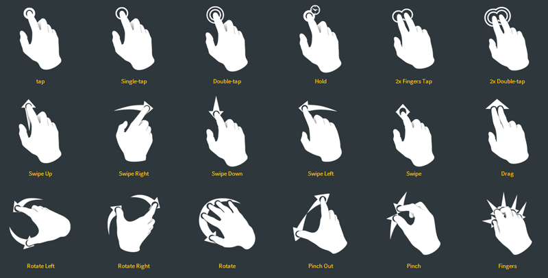

- 手势库 Hammer.js

## 移动端开发常见问题

### 1px 边框

- 标清屏下，dpr = 1 设备像素和 css 像素相等，此时 1px 没有问题
- 高清屏下，dpr > 1 设备像素 < css 像素，此时显示出的 1px 比实际更大

- 在高清屏下，并不是 1px 变粗了，而是设计想要的 1 像素，不是程序员眼中的 1css 像素，而是 1 物理像素

  - 如果 dpr=2， 设计实际想要的是 1px/2 = 0.5px
  - dpr=3, 实际就是 1px/3 = 0.33333px

- 解决方案

  1.  和设计商量，是否选择忽视
  2.  直接设置细边框
      - 存在兼容性问题，不同浏览器会有不同表现
  3.  伪类 + transform 推荐
      - 支持四个边框、颜色、圆角的设置

  ```css
  @media (-webkit-min-device-pixel-ratio: 2) {
    .border-1px {
      position: relative;
      border: none;
    }
    .border-1px::after {
      content: "";
      position: absolute;
      top: 0;
      left: 0;
      width: 200%;
      height: 200%;
      /**
      设置相应边框
       */
      border-bottom: 1px solid #ccc;
      transform-origin: 0 0;
      transform: scale(0.5);

      /*background-color: rgba(255, 0, 0, 0.5);*/
    }
  }
  @media (-webkit-min-device-pixel-ratio: 3) {
    .border-1px::after {
      width: 300%;
      height: 300%;
      /**
      设置相应边框
       */
      border-bottom: 1px solid #ccc;
      transform-origin: 0 0;
      transform: scale(0.3333);

      /*background-color: rgba(255, 0, 0, 0.5);*/
    }
  }
  ```

### click 事件 300ms 延迟

- 原因：double-tap to zoom 双击缩放，为了实现双击检测，有 300ms 的延迟，此时 click 事件不回被触发

- 解决方案

  1. 不使用 click 事件，把 click 事件中要处理的放到 touchstart 或 touchend 中去处理

  2. 禁止双击缩放，浏览器厂商的努力，两种方式

     1. viewport 中禁止缩放
        `<meta name="viewport" content="width=device-width, initial-scale=1.0,minimum-scale=1,maximum-scale=1,user-scalable=no"/>`
     2. `touch-action: manipulation`

  3. 使用 Fastclick 库，主要针对老版本浏览器

### touch 事件点击穿透

- 原因：移动端 Touch 事件会立即触发，而 click 事件会延迟一段时间触发

- 解决办法：让遮罩层不要立即消失，消失过程中添加动画

  - 设置 mask 的 opacity 从 1 变为 0 的过渡
  - 给 mask 的 transitionend 事件添加监听，设置过度完成后，display 为 none

### 移动端图片

- img 标签引入图片

  - 一般使用百分比，并且只设置宽度或高度中的一个，不同时设置，让宽高能够等比例缩放，图片不失真
  - 使用`width:100%`的问题，当图片实际宽度小于父容器宽度时，图片会被强行拉伸至与父容器同宽，造成失真问题
  - 使用`max-width:100%`的问题，当父容器大于图片实际宽度时，图片不回在继续拉伸，此时有了新的布局问题

- background 引入图片

  - 正常方式，固定高度，100%宽度，使用`background-size: cover`
  - 高度不固定，height 才是不能用了，因为 height 是相对父容器的高度，此时我们希望使用的是宽度的百分比，此时技巧是使用 padding-top:x%,x 为背景图像的(高度/宽度)，此时可以保持图片的等比例缩放，结合媒体查询一起使用，实现图片的大小图切换

## 移动 web 性能优化

- 页面响应速度：打开页面到实际能够正常使用的时间

  - 网络请求的时间
  - 页面加载和渲染的时间

- 页面交互的流畅度

  - js 脚本的执行速度

- **更快的加载页面首屏内容，无需考虑整张页面**

- 为什么优化移动端性能

  - 提升用户体验
  - 与 PC 端相比，移动端网络速度慢
  - 设备性能低

- 各阶段的性能优化点

- 具体的性能优化策略

- 具体的性能优化策略有限，所以没有策略的时候，需要根据各阶段的性能优化点来思考具体的优化方法

### 性能优化点

- 网络请求阶段的优化点

  1.  将多个资源分布在不同域上，减少请求队列的等待时间
      - 浏览器为每个域名分配的并发通道是有限的
      - 多个域意味着更多的 DNS 查询时间，通常把域名拆分到 3 ～ 5 个比较合适
  2.  通过 dns-prefetch 减少 DNS 查询时间
      - 尝试在请求资源之前解析域名
      - `<link rel="dns-prefetch" href="//g.alicdn.com"`
      - 仅对跨域上的 DNS 查找有效
      - 已经解析过的域名不要再添加 dns-prefetch
  3.  网络请求过程中的优化点
      - 减少 HTTP 请求数量
      - 合并 css、js 资源
        1.  合并后的资源不能过大
        2.  考虑缓存的问题
      - 内联首屏相关代码
      - 使用缓存 localStorage
      - 减少请求资源的大小
        - 资源的压缩(HTML\CSS 的压缩以及 JS 的压缩和混淆)
        - 开启 Gzip 压缩
          减少 cookie 的体积

### 页面加载和渲染过程中的优化点

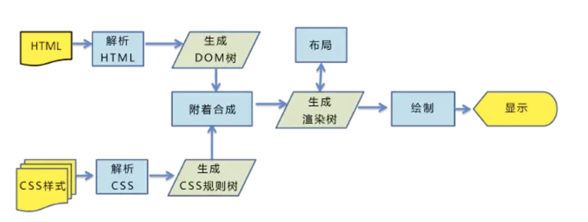

1. css 一般在 head 中引入

2. js 一般在 body 末尾引入

3. 减少回流/重布局(Reflow/Relayout)与重绘(Repaint)

   - 元素的尺寸、位置、隐藏等属性改变时，浏览器需要重新计算，就成为回流
   - 元素的外观、风格等属性改变时，浏览器只需要重新绘制，成为重绘
   - **回流一定会引起重绘，重绘不一定会引起回流**

4. JS 脚本中的优化点

   - DOM 操作优化
   - 事件优化
   - 图片懒加载和预加载

### 图片优化

1. 减少 HTTP 请求数量
   - [用 css 绘制常见的 40 种形状](https://webhek.com/post/40-css-shapes.html)
   - [有意思的 css-loading](https://photopizza.design/css_loading/)
   - 合并小图标(CSS Sprites)
   - 将小图标内嵌到 HTML 中
2. 减少请求资源的大小

   - 使用图标字体代替简单的图标
   - 压缩图片
   - 选择合适的图片大小

3. 图片类型
   - jpg
     - 有损压缩、压缩率高、不支持透明
     - 适用于色彩丰富、渐变色且不需要透明图片的场景
   - png
     - png-8 256 色 透明
     - png-24 2^24 不支持透明
     - png-32 2^24 透明
     - 适用于大部分需要透明图片的场景
   - webp
     - 与 png、jpg 相比，相同视觉体验下，图片更小
     - 支持有损压缩、无损压缩、透明和动画
     - 理论上可以完全代替 png、jpg、gif 等图片格式
     - 存在一定的兼容性问题

### 动画优化

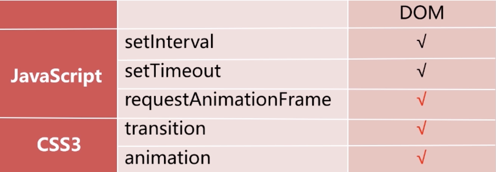

- 优先使用 CSS3 过渡和动画
- 优先使用 translate3d 做运动
- 必须使用 js 做动画时，使用 requestAnimationFrame

### CSS 优化

1. 选择器优化

   - 不要使用嵌套过于复杂的选择器，可以通过样式直接选择
   - 保持简单，不要画蛇添足
   - 避免过多的通配符选择器 \* ，少量的没问题
   - 移除无匹配样式

2. 其他优化

   - 提取共用部分
   - 避免使用 css @import 导入 css，会发送多余的 HTTP 请求，less、sass 没这个问题

### DOM 优化

1. 渲染优化

   - 减少 DOM 元素数量和嵌套层级
   - 尽量避免 table 布局，用其他标签代替，原因是，table 作为一个整体解析，要等整个表格都解析完才显示，改动一点点，也会造成整个 table 的重新布局

2. 选择器优化

   - 优先使用 id 获取单个元素
   - 多个元素，直接通过 className 来获取

3. 减少 DOM 操作次数

   - 总是将选择器的选择结果缓存起来
   - `const $list = document.getElementById('list')`
   - 避免在循环中多次使用 innerHTML，在虚幻结束后使用一次即可

   ```js
   for (const item of todoData) {
     $list.innerHTML += `<li class="item">${item}</li>`;
   }
   //变成
   let html = "";
   for (const item of todoData) {
     html += `<li class="item">${item}</li>`;
   }
   $list.innerHTML = html;
   ```

   - 使用 DocumentFragment 优化多次的 appendChild

   ```js
   for (const item of todoData) {
     const li = document.createElement("li");
     li.className = "item";
     li.innerHTML = item;
     //新创建的元素，完成必要操作后再添加到页面中
     $list.appendChild(li);
   }
   //改成
   const $liFragment = document.createDocumentFragment();
   for (const item of todoData) {
     const li = document.createElement("li");
     li.className = "item";
     li.innerHTML = item;
     $liFragment.appendChild(li); //此时避免了循环每次直接操作文档的回流重绘
   }
   $list.appendChild($liFragment);
   ```

   - 新创建的元素，完成必要操作后再添加到页面中

   - 不要通过 js 直接修改 style，通过添加和移除 class 修改元素样式

   ```js
   //toggle => active有？添加：移除
   $box.classList.toggle("active");
   ```

   - 注意强制回流，当获取的属性值包括但不限于 offsetTop、offsetLeft、scrollTop、clientTop 这些 全局属性 时，需要此时页面上的其他元素的布局和样式处于最新状态，这回引起多次的回流和重绘，这样的操作称为强制回流
     [强制回流](https://gist.github.com/paulirish/5d52fb081b3570c81e3a)
   - 遇到上面情况时，可以将结果缓存起来，需要更新的时候在更新

### 事件代理

- 原本在子元素监听的事件，委托给父元素，让父元素监听

- 判断目标元素两种方法

  - e.target.tagName.toLowerCase() === "tagName"
  - e.target.classList.contains("className")

### 事件稀释

- 有些事件在一段时间会多次触发，事件稀释就是减少这些事件的触发频率
- 比如 scroll、resize、mousemove、touchmove 等

1. 防抖 debounce

   - 在某个时间期限内，事件处理函数只执行一次
     [debounce](./debounce&throttle.html)

2. 节流 throttle
   - 事件处理函数执行一次后，在某个时间期限内不再工作
     [throttle](./debounce&throttle.html)

### 图片懒加载

- 图片延迟(按需)加载

- 图片懒加载的实现

[img-lazy-loading](./img-lazy-loading.html)

### 图片预加载

- 提前加载将来可能会用到的图片

- 实现
  [pre-img](./pre-img.html)
