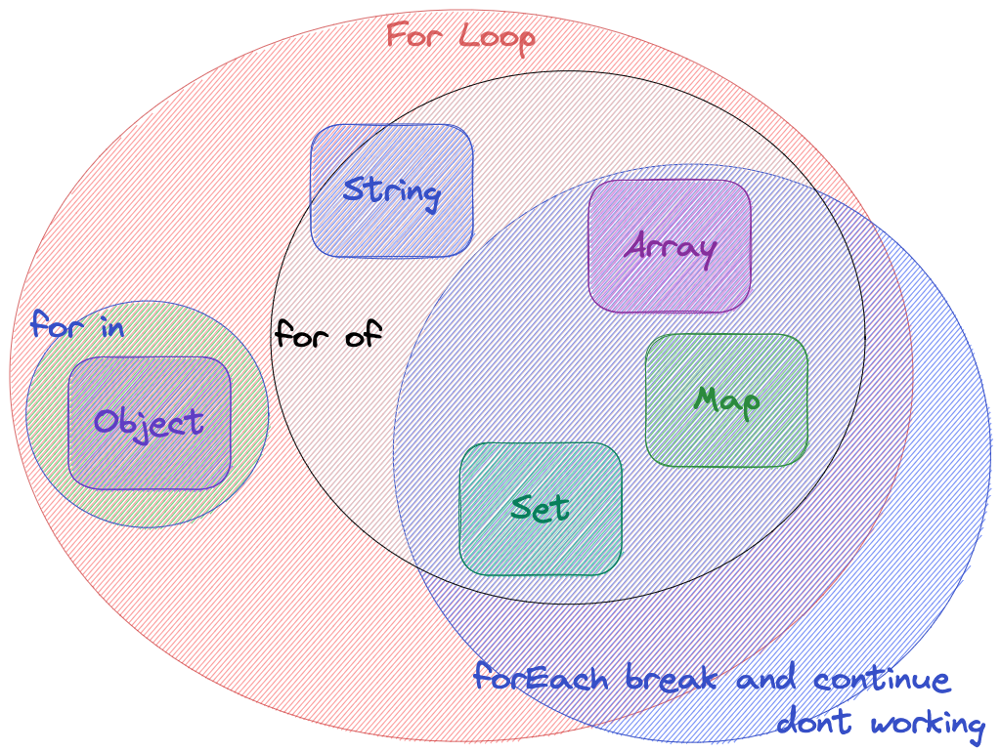

# 各种循环的总结

## for 循环语句

`for(let i ;i<length;i++){}`

> 自由度高，对象、数组都能遍历，但不够简洁。

## for…in 循环语句

`for(const key in obj){};`

> 大部分用来循环遍历对象，也可以遍历数组，只可遍历键值(或索引)。需说明 js 里万物皆对象，数组也是属性为数组下标的对象。

## for…of 循环语句

1. `for(const index of arr.keys())` 获取迭代元素下标
2. `for(const value of arr)` 获取迭代元素值
3. `for(const [index,value] of arr.entries())` 获取迭代元素的键值对 （常常结合结构赋值）

- 可遍历数组的索引和值以及对象的键值与值；
  Object.keys(),Object.values(),Object.entries()来使用。

## forEach 方法（注意带上函数 function 或=>）

1. `arr.forEach(function(value,index,arr){},this 指向)`
2. `s.forEach(function(value,index,s){},this 指向)`
3. `m.forEach(function(value,index,m){},this 指向)`

- 用于数组、Set、Map 的遍历，可以遍历索引、值，但 forEach 不能使用 break、continue

Set、Map 去重，特性

总结使用场景：
1、对象优先使用 for…in
2、数组优先使用 for…of 或 forEach，根据需求选择
3、Set、Map 优先使用 forEach
